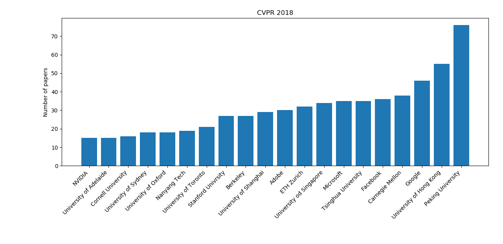

# conference-analysis
Some data analysis done in some computer vision and machine learning conference papers.

In this repo I will try to keep a running analysis of the papers presented in some popular conferences on computer vision and machine learning. My hope is to keep adding new statistics during my free time. For now only an analysis of the institutions is available.

Institutions at CVPR 2018:

